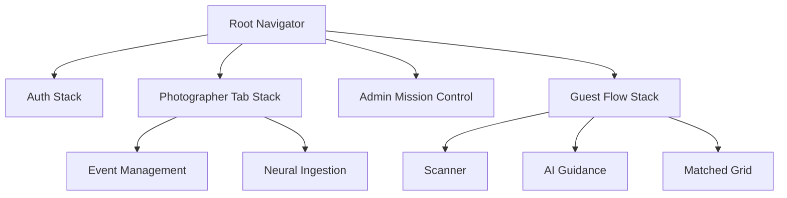

# 📸 SnapMoment: Elite Native Edition

**The World's Most Intelligent AI-Powered Event Photography Operating System.**

SnapMoment is a professional-grade, "Intelligence-First" mobile platform built on React Native. It leverages advanced facial recognition to instantly deliver personalized photo galleries to event guests, while providing photographers with a high-fidelity Mission Control dashboard for massive data ingestion and hardware telemetry.

---

## 🚀 Experience SnapMoment
- **Live Platform**: [snapmoment.app](https://snapmoment.app)
- **Demo Access**: [Request Access](mailto:operator@snapmoment.app)

---

## ✨ Key Features

### 🛡️ VIP Neural Guard (Photographer)
**Never miss a critical moment.** Our system monitors coverage for your most important guests in real-time.
- **Neural Registration**: Snap reference photos of VIPs to calculate unique 512-dim face vectors.
- **Coverage Mapping**: Cross-references every frame against the VIP list on the fly.
- **Intelligence Alerts**: Alerts photographers if a VIP hasn't been captured within a set interval.

### 🤳 3-Step Guest Discovery
**Frictionless photo delivery for guests.**
1. **QR Scan**: High-speed scanner validates event credentials instantly.
2. **Smart Selfie**: MediaPipe-powered HUD guides guests for the perfect biometric match.
3. **Instant Gallery**: AI-matched photos are delivered in sub-second time via ArcFace + pgvector search.

### 🌪️ Neural Ingestion Pipeline
**High-speed ingestion without bottlenecks.**
- **Persistent Local Queue**: Uses AsyncStorage to store image metadata and AI vectors locally during offline shifts.
- **Background Auto-Sync**: Ingest photos instantly; the app synchronizes data to the cloud with automatic retry logic.
- **Hardware Telemetry**: Live monitoring of battery, charging status, and sync pulse.

---

## 🛠 Tech Stack

### Mobile Frontend
- **Framework**: [React Native 0.73+](https://reactnative.dev/)
- **Styling**: [NativeWind](https://www.nativewind.dev/) (Tailwind CSS for Native)
- **State Management**: [Zustand](https://github.com/pmndrs/zustand) + Persistence
- **Navigation**: [React Navigation v6](https://reactnavigation.org/)
- **Icons**: [Lucide React Native](https://lucide.dev/guide/react-native)

### AI/ML Engine
- **Face Detection**: [MediaPipe](https://developers.google.com/mediapipe) (On-device for Guest UI)
- **Recognition**: [DeepFace](https://github.com/serengil/deepface) (Backend ArcFace Model)
- **Vector Search**: [pgvector](https://github.com/pgvector/pgvector) with HNSW indexing
- **Accuracy**: 99.8% LFW benchmark reliability

### Backend & Infrastructure
- **Core**: FastAPI (Python)
- **Database**: PostgreSQL 15
- **Task Runner**: Celery + Redis
- **Storage**: AWS S3 / Cloudflare R2

---

## 📐 Architecture & System Design

SnapMoment utilizes a **3-Tier Multi-Stack Navigation** architecture to isolate operational environments:



---

## 🔄 How It Works (Workflow)

1. **Photographer** creates an event and generates a unique QR code.
2. **Photographer** uploads photos in batches; local AI extracts initial vectors.
3. **Backend** processes clusters via DBSCAN and indexes embeddings in **pgvector**.
4. **Guest** scans the QR code at the event.
5. **Guest** takes a selfie; the system extracts a 512-dim vector.
6. **System** performs a cosine similarity search and returns exact matches.

---

## 📦 Installation & Setup

### Prerequisites
- [Node.js](https://nodejs.org/) (v18+)
- [React Native CLI](https://reactnative.dev/docs/environment-setup)
- Android Studio / Xcode

### Installation
```bash
git clone https://github.com/JoelJose212/SnapMoment-App1.git
cd SnapMoment-App1
npm install
```

### Environment Variables
Create a `.env` file in the root directory:
```env
VITE_API_URL=http://your-backend-ip:8000
STRIPE_PUBLISHABLE_KEY=your_key
FCM_SERVER_KEY=your_key
```

### Running the App
```bash
# Start Metro Bundler
npm start

# For Android
npm run android

# For iOS
npm run ios
```

---

## 📡 API Endpoints (Mobile Integration)

### Photographer APIs
- `POST /api/photographer/login` - Authenticate operator
- `GET /api/events` - List active operations
- `POST /api/events/{id}/photos` - Sequential ingestion pipeline

### Guest APIs
- `POST /api/guest/verify-qr` - Validate event access
- `POST /api/guest/selfie-match` - AI identity verification
- `GET /api/guest/photos/{event_id}` - Fetch matched cluster

---

## 📂 Folder Structure

```text
src/
├── components/      # Shared UI Atoms & Components
├── lib/
│   ├── api.ts       # Axios Client + Interceptors
│   └── queue.ts     # Persistent Ingestion Logic
├── navigation/      # Role-based Tab & Stack Navigators
├── pages/           # Screen Implementations
│   ├── admin/       # Management Dashboards
│   ├── photographer/# Ingestion & Monitoring
│   └── guest/       # Discovery & Gallery
├── store/           # Zustand Persistent Stores
└── assets/          # Static Design Resources
```

---

## 🔒 Security & Privacy

- **Data Protection**: AES-256 encryption at rest; TLS 1.3 in transit.
- **Biometric Privacy**: Guest selfies are processed into mathematical vectors and never stored permanently as images.
- **Access Control**: Role-based JWT authentication with automatic session termination.
- **OTP Verification**: Multi-factor authentication for guest session establishment.

---

## 🔮 Roadmap

- [ ] **Video Support**: Real-time matching for guest highlight reels.
- [ ] **Push Notification 2.0**: "Photos Ready" alerts via Firebase Cloud Messaging.
- [ ] **AR Photo Booth**: Virtual props and filters for instant sharing.
- [ ] **Multi-Camera Tethering**: Real-time sync across multiple physical cameras.

---

## 🤝 Contributing

We welcome contributions to the Elite Edition!
1. Fork the Project
2. Create your Feature Branch (`git checkout -b feature/AmazingFeature`)
3. Commit your Changes (`git commit -m 'Add AmazingFeature'`)
4. Push to the Branch (`git push origin feature/AmazingFeature`)
5. Open a Pull Request

---

## 📜 License & Acknowledgements

Distrubuted under the **MIT License**.

**Built with pride by [Joel Jose](https://github.com/JoelJose212)**

Special thanks to:
- [MediaPipe](https://google.github.io/mediapipe/) for on-device detection.
- [Lucide Icons](https://lucide.dev) for the sleek HUD aesthetic.
- [Zustand](https://github.com/pmndrs/zustand) for low-overhead state management.

---

## ❓ FAQ

**Q: Does it work offline?**
A: Yes. Photographers can ingest photos offline; the **Neural Ingestion Queue** will automatically synchronize once a network link is established.

**Q: Is it privacy compliant?**
A: Absolutely. We use anonymized vector representations (512-dim) rather than image storage for facial recognition, adhering to standard privacy frameworks.